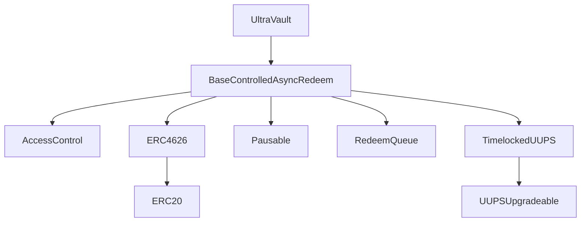

# Contract Architecture

## Inheritance diagram

## Inheritance and responsibility split

`UltraVault` inherits from `BaseControlledAsyncRedeem`.

- `BaseControlledAsyncRedeem` provides:
  - ERC-4626-compatible deposit/mint interfaces
  - async redeem request/fulfillment/claim accounting
  - support for multi-asset deposits and withdrawals
  - role-based access control
  - pause controls
  - upgrade management
- `UltraVault` adds:
  - holding assets on `fundsHolder` address instead of in the vault itself
  - oracle-driven `totalAssets` calculation based on the published share price
  - fee configuration and collection

## Storage

Both contracts use explicit ERC-7201-style storage slots. This is relevant for upgrade safety and clear storage ownership per module.

## Core modules

- **User entry points**: `deposit`, `mint`, `requestRedeem`, `withdraw`, `redeem`.
- **Redeem accounting**: pending vs claimable tracked via `RedeemQueue`.
- **Asset conversion**: base asset <-> supported assets through `rateProvider`.
- **Valuation**: share-to-asset quote through vault oracle.
- **Fee engine**: management/performance/withdrawal logic in `UltraVault`.

## Hooks

`BaseControlledAsyncRedeem` exposes hooks:

- `beforeDeposit` / `afterDeposit`
- `beforeWithdraw` / `afterWithdraw`
- `beforeRequestRedeem`
- `beforeFulfillRedeem` / `afterFulfillRedeem`

- `UltraVault` uses `afterDeposit` hook to transfer assets to `fundsHolder` right after deposit.
- `UltraVault` uses `beforeFulfillRedeem` hook to transfer assets in from `fundsHolder` right before redeem fulfillment.

## Async redeem data model

Redeem lifecycle keeps two states per controller + asset:

- **Pending redeem**: requested, not yet settled.
- **Claimable redeem**: settled by operator, available for withdrawal/redeem.

This enables batched operational settlement while keeping user claim accounting on-chain.

## Upgradeability and governance controls

- Upgradeability uses timelocked UUPS pattern.
- Critical address updates (rate provider/oracle/funds holder) follow propose/accept windows.
- Accepting critical updates pauses the vault to require operational verification before reopening deposits.
